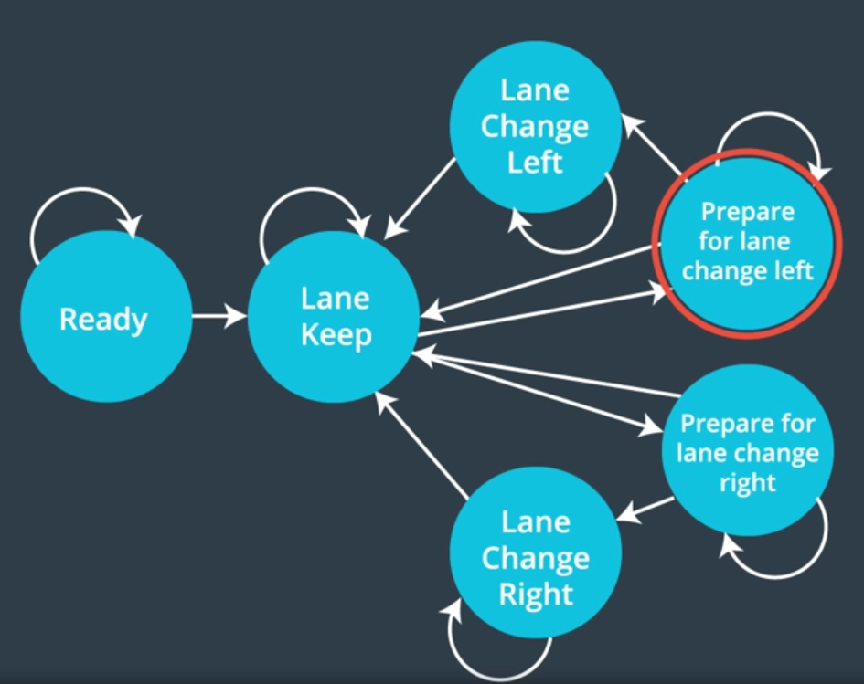
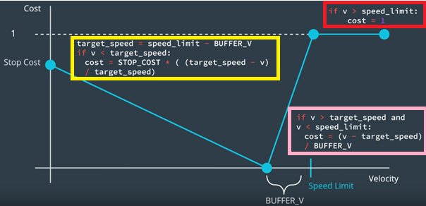

# Behavior Planning by Finite State Machine 
 In this section I am going to teach an approach to behavior planning that uses something called a Finite State Machine to solve the behavior planning problem. 
 
## 1.	Introduction
If you think about the over all flow of data in a self-driving car operating on the fastest time scales you have: 

1.	First [Motion](https://github.com/A2Amir/Motion-Model-of-a-Car) Control
2.	Than  you have [Sensor Fusion](https://github.com/A2Amir/Extended-Kalman-Filter-for-Sensor-Fusion-Radar-and-Lidar).
3.	Just lower than you have [localization](https://github.com/A2Amir/Implement-a-particle-filter-in-the-context-of-Cplus) and trajectory planning.
4.	Next is [Prediction](https://github.com/A2Amir/Prediction-Phase-in-the-trajectory-generation-of-cars) which you just learned about.
5.	And then at the top is behavior planning with the lowest update rate.

  
 

The inputs to behavior planning come from the prediction module and the localization module and both of which get their inputs from the sensor fusion.

The output from the behavior module goes directly to the trajectory planner, which also takes input from prediction and localization so that it can send trajectories to the motion controll.

Everything inside of the green box in the imag above is the focus of this repository and is commonly referred to as Path Planning.

We will start by doing a brief introduction where you'll learn more about the details of the inputs and outputs to behavior planner and understand what problems a behavior planning module is expected to solve.Next, we will talk about Finite State Machines as one technique for implementing a behavior plan, followed by a more in-depth look at the Cost Functions we will use to actually make behavioral level decisions.

## 2.	Understanding Output
It's possible to suggest a wide variety of behaviors by specifying only a few quantities. For example by specifying only a target lane, a target vehicle (to follow), a target speed, and a time to reach these targets, we can make suggestions as nuanced as "stay in your lane but get behind that vehicle in the right lane so that you can pass it when the gap gets big enough."
Look at the picture below and 5 potential json representations of output and see the json representation match with the corresponding verbal description.

  
 

  
 
To see 3 potential json representations of output ckick  <a href="https://github.com/A2Amir/Behavior-Planning-by-Finite-State-Machine/blob/master/img/4.png" rel="Here">Here</a>

## 3.	The Behavior Problem
The behavior planner is currently a black box, which takes as input a map of the world,a route to the destinations,and predictions about what other static and dynamic obstacles are likely to do and it produces as output a adjusted maneuver for the vehicle which the trajectory planner is responsible for reaching collision-free, smooth, and safe.The goal of this repository is to open up this black box and learn how to implement a behavior planner.

  
 

 
The responsibilities of the behavior module are to suggest maneuvers which are feasible, as safe as possible, legal, and efficient. What the behavior planner is not responsible for are execution details and collision avoidance.

The approach to behavior planning we are going to teach in is the same one used by most of the vehicles, including the winning one in the DARPA Urban Challenge. In fact, it's the approach to behavior planning that Mercedes used in their Bertha Benz Drive,which you can see is capable of handling complex traffic situations like navigating intersections and dense urban traffic.

## 4.Finite State Machines

In this section I am going to teach an approach to behavior planning that uses something called a Finite State Machine to solve the behavior planning problem. A Finite State Machine makes decisions based on a finite set of discrete states. In the example below five. When initialized, a Finite State Machine begins in some start state let's call it S0.

  
 

Any pair of states within the finite state machine can be connected by one or more transitions and sometimes there is a transition back to the same state, which is called a **Self Transition**.

Not all transitions are necessarily possible. For example, S4 doesn't transition to any other state, which in the language of finite state machines called an **Accepting State**. For non-accepting states that can often be multiple potential successor states.

To decide which state to transition to next,a Finite State Machine needs to handle some sort of input and then use a state transition function to decide what state to go next.

We want to formalize what a Finite State Machine is,with the help of a simple example. Let's consider a simple vending machine where everything costs 20 cents and let's say that this vending machine only takes nickels and dimes but nothing larger or smaller.
Then we can model the state of this vending machine by the amount of money that's been deposited.

The start state would be zero cents and from this date there are two things that can happen. We could put in a nickel,which would make the state five cents or we could put in a dime to take the state to 10 cents. The rest of the transitions are fairly straightforward until we think about what to do if we are in the 15 cent state and someone puts in a dime.
We could just count that as 20 but let's say that this machine requires exact change so that a dime would just fall through and come out of the little tray at the bottom of the machine. As you can see, finite state machines are pretty straightforward conceptually.

  
 

Finite state machines have the strengths:

* First, finite state machines are very easy to reason about. They are basically self-documenting because they map the logical state of a system directly to the physical state.
* Next, they are maintainable. If we wanted to tweak this machine so that everything costs a quarter it would be pretty trivial to just add one more state.

The weaknesses of the finite state machine:
* The primary one being that they are easily abused. If they aren't designed well to begin with or if the problem changes you can easily find yourself saying things like,I hadn't considered that.
* By adding another state can lead to some sloppy code and sloppy logic, which in practice means that finite state machines can be very difficult to maintain as the states base gets bigger.

## 5.States for Self Driving Cars

When we're thinking about a simple vending machine it's easy to enumerate the states. Now let's consider the states we may want to model for car driving on a highway.

  
 

The truth is there isn't a single correct set of states to choose from

* On one hand we want to keep our state space as small as possible for maintainability reasons,
* On the other hand we want to make sure we have enough logical States to actually represent all the physical states that we care about.

Since we wanted to focus on highway driving, but we still debated what states we should use for our finite state machine. We quickly agreed on five (keep lane, change lane left, change lane right, prepare lane change left and prepare lane change right),  because most of the states in the image above can be thought of as various implementations of the keep lane state.

  
 

We did decide to use these states for these lessons.When we only have five states plus a ready state,the finite state machine looks like below.

  
 

We should probably clarify what we mean by these states: 

* Let‘s assume that we are in the keep lane state. let me explain what this state means. The lane keep state attempts to stay in the current lane by staying near the center line for that lane. So thinking in freenet coordinates, we might just say that target d for the vehicle is whatever the d for the lane is and for the s direction, keep lane state attempts to drive at the vehicle's target speed when that's feasible, but when it's not, it will try to drive at whatever speed is safest for the lane.

* For lane changes the goal is to move from the initial lane to the target lane. The d behavior is what you might expect to move left or right as appropriate. the target d is the d for the corresponding lane to the left or right of the ego's current lane and for s, the same rules as lane keeping apply, the vehicle will try to drive at the target speed,but if that's not feasible, then it will drive at whatever speed is safe for the initial lane.

* to prepare for a lane change left or right, which means in the d directions we still can stay in the current lane but in the s direction we try to match the position and speed of some gap in one of the adjacent lanes. This is also when we would turn on the appropriate signal.

Note that the only way to change lanes is to first prepare for a lane change.Let's see what that would look like below:

  
 

### 5.1.Inputs to Transition Functions

We just saw in the prevoius section how the states we choose to use can impact the behavior of the vehicle. But deciding <b>how those states transition and what inputs the transition functions use is crucial to the actual implementation of a finite-state machine</b>.

For the example with the vending machine, the only input was the coin. The self-driving car is more complicated. Now the question is What data will we need to pass to our transition functions as input?

  
 

The answer is, we have to pass all of data (Prediction, Map, Speed Limit, Localization Data, Current State) into the transition function.

### 5.2.	Implementing a Transition Function

One way to implement a transition function is by generating rough trajectories for each accessible "next state" and then finding the best. To "find the best" we generally use cost functions. We can then figure out how costly each rough trajectory is and then select the state with the lowest cost trajectory.
read carefully through the pseudocode below to get a better sense for how a transition function might work.
~~~ c++
def transition_function(predictions, current_fsm_state, current_pose, cost_functions, weights):
    # only consider states which can be reached from current FSM state.
    possible_successor_states = successor_states(current_fsm_state)

    # keep track of the total cost of each state.
    costs = []
    for state in possible_successor_states:
        # generate a rough idea of what trajectory we would
        # follow IF we chose this state.
        trajectory_for_state = generate_trajectory(state, current_pose, predictions)

        # calculate the "cost" associated with that trajectory.
        cost_for_state = 0
        for i in range(len(cost_functions)) :
            # apply each cost function to the generated trajectory
            cost_function = cost_functions[i]
            cost_for_cost_function = cost_function(trajectory_for_state, predictions)

            # multiply the cost by the associated weight
            weight = weights[i]
            cost_for_state += weight * cost_for_cost_function
         costs.append({'state' : state, 'cost' : cost_for_state})

    # Find the minimum cost state.
    best_next_state = None
    min_cost = 9999999
    for i in range(len(possible_successor_states)):
        state = possible_successor_states[i]
        cost  = costs[i]
        if cost < min_cost:
            min_cost = cost
            best_next_state = state 

    return best_next_state

~~~
What are these cost functions and how do we create them? In the next section we are going to explain and create them. 

#### 5.2.1.	Cost Function - Speed Penalty

A key part of getting transitions to happen when we want them to is the design of reasonable cost functions. We want to penalize and reward the right things. I'm going to work through an example of one way you might think about designing a cost function. Let's consider how we would design a cost function for vehicle speed.

On one hand, we want to get to our destination quickly. 
On the other hand,we don't want to break the law.

An essential quantity we have to control is the desired velocity of the car. Some velocities are more beneficial, some are even illegal. Let's fill in the graph below and try to assign some costs to every velocity.

For the sake of simplicity:

* We assume that all of the cost functions will have an output between zero and one.

* We will adjust the importance of each cost function later by adjusting the weights.

Let's draw the speed limit for the road we are on at point C. Well, we know that if we're going well above the speed limit that should be maximum cost (D) and maybe we want to set an ideal zero cost speed(B) that's slightly below the speed limit so that we have some buffer and then we can think about how much we want to penalize not moving at all.
Obviously, not moving is bad, but maybe not as bad as breaking the speed limit, we would put it at point A.

We can again arbitrarily connect these points with linear function and the flat maximum cost for anything above the speed limit. 

  
 

Now, in practice, we might actually want to parametrize some of these quantities so that we could later adjust them until we got the right behavior.

* first, we might define a parameter called Stop Cost for the zero-velocity case
* A parameter called buffer velocity which would probably be a few miles per hour.

Then, our overall cost function has three domains:

* If we're going less than the target speed, which has the cost function in the yellow box.

* If we are above the speed limit,the cost is in the red box.

* If we are between, the cost would look like in the ping box. 

  
 

#### 5.2.2.	Cost Function - Lane Change Penalty

In the image below, the blue self driving car (bottom left) is trying to get to the goal (gold star). It's currently in the correct lane but the green car is going very slowly, so it considers whether it should perform a lane change (LC) or just keep lane (KL). These options are shown as lighter blue vehicles with a dashed outline.

  
 

If we want to design a cost function that deals with lane choice, it will be helpful to establish what the relevant variables are. In this case, we can define:
	
* Δs=sG - s: how much distance the vehicle will have before it has to get into the goal lane.

When we're far from the goal we have lots of time to get into the goal lane. As we get closer things get more urgent. Mathematically we could say "costs associated with lane choice should be inversely proportional to delta s".

*	Δd=dG −dLC/KL: the lateral distance between the goal lane and the options being considered. In this case ΔdKL=dG−dKL would be zero and ΔdLC=dG−dCL would not. 

In general we'd prefer to be closer to the goal lane. Which means the cost should be bigger when delta d is bigger. Mathematically we could say "Cost associated with lane choice should be proportional to delta d.

Therfore we want a cost function that penalizes large ∣Δd∣ and we want that penalty to be bigger when Δs is small and we want also to make sure that the maximum cost of this cost function never exceeds one and that the minimum never goes below zero, which shown below meet the criteria we want.

  
 

In this example, we found that the ratio ∣Δd∣/Δs was important. If we call that ratio x we can then use that ratio in any function with bounded range. These functions tend to be useful when designing cost functions. These types of functions are called Sigmoid Functions. You can learn more in the [Wikipedia article](https://en.wikipedia.org/wiki/Sigmoid_function) if you're interested.

#### 5.2.3.	Implement Lane Change Penalty in C++

